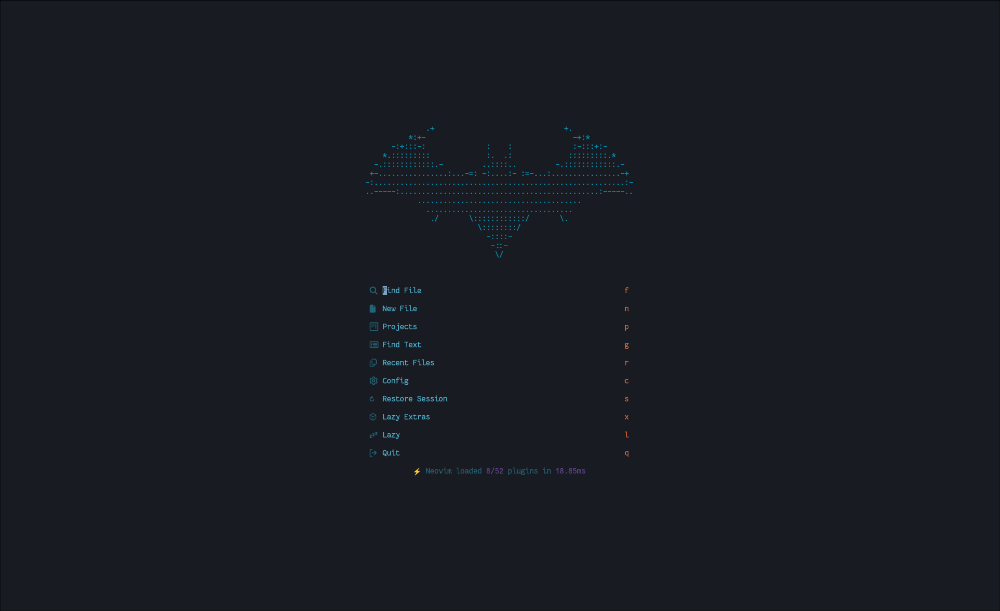
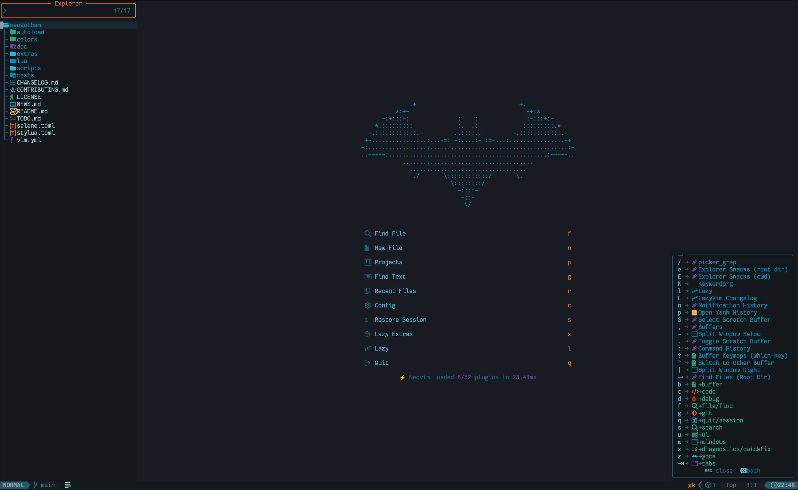

# Neogotham

A dark and brooding theme based on [whatyouhide/vim-gotham](https://github.com/whatyouhide/vim-gotham?tab=readme-ov-file) using [TokyoNight's](https://github.com/folke/tokyonight.nvim) tooling to make better LazyVim integrations

This is heavliy WIP




## Features

- 1 theme (DARK)
- uses Tokyonight's tooling to make the magic happen.

Extra / plugin support is handled by bindings from TokyoNight: if it looks bad I
haven't fixed it yet!

<details>
<summary>🎨 Supported Plugins</summary>

<!-- plugins:start -->

| Plugin                                                      | Source                                             |
| ----------------------------------------------------------- | -------------------------------------------------- |
| [dashboard-nvim](https://github.com/nvimdev/dashboard-nvim) | [`dashboard`](lua/tokyonight/groups/dashboard.lua) |
| [lazy.nvim](https://github.com/folke/lazy.nvim)             | [`lazy`](lua/tokyonight/groups/lazy.lua)           |
| [which-key.nvim](https://github.com/folke/which-key.nvim)   | [`which-key`](lua/tokyonight/groups/which-key.lua) |

<!-- plugins:end -->

</details>

## ⚡️ Requirements

- [Neovim](https://github.com/neovim/neovim) >=
  [0.8.0](https://github.com/neovim/neovim/releases/tag/v0.8.0)

## 📦 Installation

Install the theme with your preferred package manager, such as
[folke/lazy.nvim](https://github.com/folke/lazy.nvim):

```lua
{
  "curlyfries13/neogotham",
  lazy = false,
  priority = 1000,
  opts = {},
}
```

## 🚀 Usage

```lua
vim.cmd[[colorscheme neogotham]]
```

```vim
colorscheme neogotham

```

Some plugins need extra configuration to work with **TokyoNight**. (and
therefore Neogotham)

<details>
  <summary>Click here for more details</summary>

### [Barbecue](https://github.com/utilyre/barbecue.nvim)

```lua
-- Lua
require('barbecue').setup {
  -- ... your barbecue config
  theme = 'neogotham',
  -- ... your barbecue config
}
```

### [Lualine](https://github.com/nvim-lualine/lualine.nvim)

```lua
-- Lua
require('lualine').setup {
  options = {
    -- ... your lualine config
    theme = 'neogotham'
    -- ... your lualine config
  }
}
```

### [Lightline](https://github.com/itchyny/lightline.vim)

```vim
" Vim Script
let g:lightline = {'colorscheme': 'neogotham'}
```

</details>

## ⚙️ Configuration

> [!IMPORTANT]
> Set the configuration **BEFORE** loading the color scheme with `colorscheme neogotham`.

The theme offers one style: [dark](#dark)

Neogotham uses the default options, unless `setup` is explicitly called. (just
like TokyoNight)

<details>
  <summary>Default Options</summary>

<!-- config:start -->

```lua
---@class tokyonight.Config
---@field on_colors fun(colors: ColorScheme)
---@field on_highlights fun(highlights: tokyonight.Highlights, colors: ColorScheme)
M.defaults = {
  style = "dark",
  transparent = false, -- Enable this to disable setting the background color
  terminal_colors = true, -- Configure the colors used when opening a `:terminal` in Neovim
  styles = {
    -- Style to be applied to different syntax groups
    -- Value is any valid attr-list value for `:help nvim_set_hl`
    comments = { italic = true },
    keywords = { italic = true },
    functions = {},
    variables = {},
    -- Background styles. Can be "dark", "transparent" or "normal"
    sidebars = "dark", -- style for sidebars, see below
    floats = "dark", -- style for floating windows
  },
  day_brightness = 0.3, -- Adjusts the brightness of the colors of the **Day** style. Number between 0 and 1, from dull to vibrant colors
  dim_inactive = false, -- dims inactive windows
  lualine_bold = false, -- When `true`, section headers in the lualine theme will be bold

  --- You can override specific color groups to use other groups or a hex color
  --- function will be called with a ColorScheme table
  ---@param colors ColorScheme
  on_colors = function(colors) end,

  --- You can override specific highlights to use other groups or a hex color
  --- function will be called with a Highlights and ColorScheme table
  ---@param highlights tokyonight.Highlights
  ---@param colors ColorScheme
  on_highlights = function(highlights, colors) end,

  cache = true, -- When set to true, the theme will be cached for better performance

  ---@type table<string, boolean|{enabled:boolean}>
  plugins = {
    -- enable all plugins when not using lazy.nvim
    -- set to false to manually enable/disable plugins
    all = package.loaded.lazy == nil,
    -- uses your plugin manager to automatically enable needed plugins
    -- currently only lazy.nvim is supported
    auto = true,
    -- add any plugins here that you want to enable
    -- for all possible plugins, see:
    --   * https://github.com/folke/tokyonight.nvim/tree/main/lua/tokyonight/groups
    -- telescope = true,
  },
}
```

<!-- config:end -->

</details>

## 🪓 Overriding Colors & Highlight Groups

How the highlight groups are calculated:

1. `colors` are determined based on your configuration, with the ability to
   override them using `config.on_colors(colors)`.
1. These `colors` are utilized to generate the highlight groups.
1. `config.on_highlights(highlights, colors)` can be used to override highlight
   groups.

Refer to [TokyoNight's
docs](https://github.com/folke/tokyonight.nvim?tab=readme-ov-file#-overriding-colors--highlight-groups)
since nothing else has changed here

## 🍭 Extras

Extra color configs for [Kitty](https://sw.kovidgoyal.net/kitty/conf.html),
[Alacritty](https://github.com/alacritty/alacritty),
[Fish](https://fishshell.com/docs/current/index.html), [WezTerm](https://wezfurlong.org/wezterm/config/files.html),
[iTerm](https://iterm2.com/) and [foot](https://codeberg.org/dnkl/foot) can be
found in [extras](extras/). To use them, refer to their respective
documentation.

```lua
local colors = require("neogotham.colors").setup() -- pass in any of the config options as explained above
local util = require("neogotham.util") -- this is the same as tokyonight

aplugin.background = colors.bg_dark
aplugin.my_error = util.lighten(colors.red1, 0.3) -- number between 0 and 1. 0 results in white, 1 results in red1
```

## 🔥 Contributing

Pull requests are welcome! Please see [CONTRIBUTING.md](CONTRIBUTING.md) for guidelines on adding new extras and general contribution guidelines.
